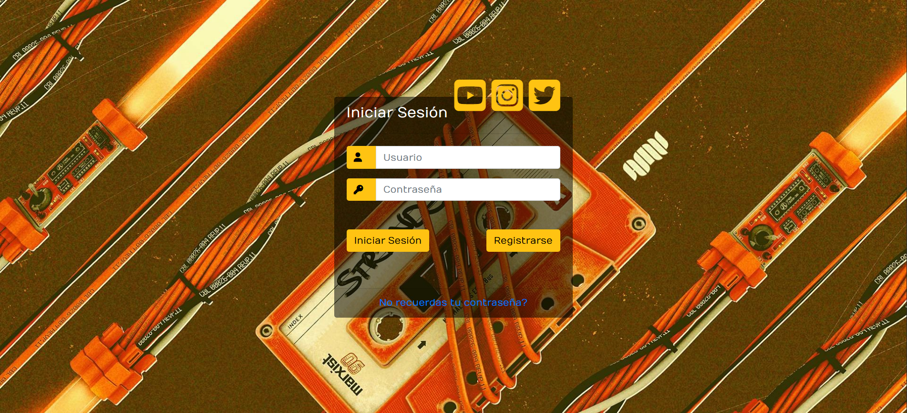
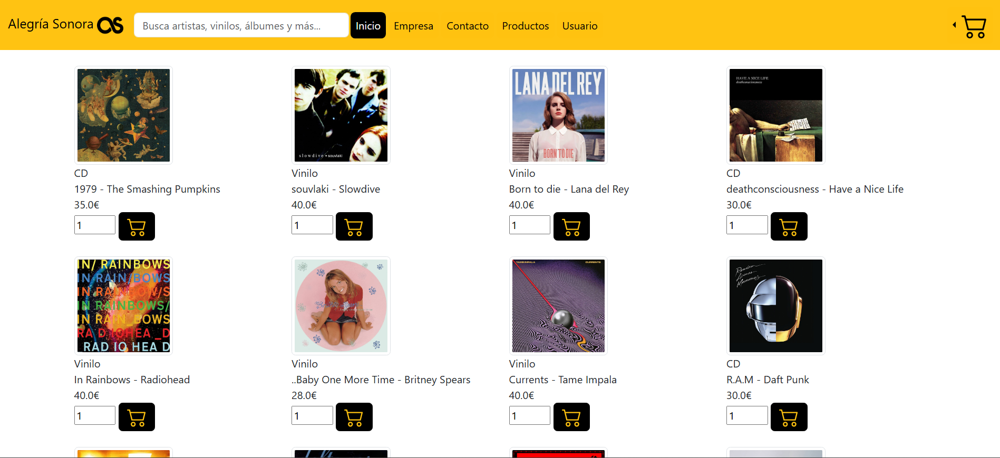

# E-Commerce de Vinilos

## 📝 Descripción
Plataforma web de comercio electrónico dedicada a la venta de discos de vinilo y CDs. La aplicación permite a los usuarios navegar por un catálogo musical, gestionar un carrito de compras, realizar pedidos y contactar con los administradores.

<p align="center">
  
  
</p>

El proyecto sigue el patrón de arquitectura **MVC (Modelo-Vista-Controlador)**.

Fue realizado en la asignatura Desarrollo de Aplicaciones Web en la Universitat de València en 2023.

## Arquitectura y Tecnologías
* **Backend:** Java (Servlets/JSP) gestionado con Apache Maven.
* **Frontend:** HTML5, CSS3, JSP.
* **Persistencia:** MySQL.
* **Servidor:** Apache Tomcat.

## Instalación y Despliegue

### Prerrequisitos
* Java JDK 8+.
* Apache Maven.
* MySQL Server.
* Apache Tomcat.

### 1. Configuración de la Base de Datos
El proyecto incluye un script de inicialización con datos de prueba.

1.  Crea una base de datos vacía en MySQL (por ejemplo, llamada `db` o `vinilos_db`):
    ```sql
    CREATE DATABASE vinilos_db;
    ```
2.  Importa el script `db.sql` que encontrarás en la carpeta `/db`:
    * **Desde consola:**
      ```bash
      mysql -u tu_usuario -p vinilos_db < db/db.sql
      ```
    * **Desde Workbench / PHPMyAdmin:** Selecciona la base de datos `vinilos_db` y usa la opción "Importar" seleccionando el archivo `db.sql`.

3.  **Conexión JDBC:** Abre el archivo de configuración de conexión en tu proyecto Java (usualmente en `src/main/resources` o en una clase `Conexion.java`) y asegúrate de que la URL apunte a tu base de datos:
    ```java
    jdbc:mysql://localhost:3306/vinilos_db
    ```

### 2. Compilación (Build)
Desde la raíz del proyecto, ejecuta:

```bash
mvn clean install
```
Esto descargará las dependencias y generará el archivo `.war` en `target/`.

### 3. Despliegue en Tomcat
Copia el archivo `.war` generado a la carpeta `webapps` de Tomcat e inicia el servidor.

Accede a la web en: `http//localhost:8080/tienda-vinilos`

## Funcionalidades
* **Catálogo:** Listado de productos con imágenes, precios y distinción entre Vinilo/CD.
* **Usuarios:** Sistema de login con roles.
* **Pedidos:** Gestión de estado de pedidos.
* **Mensajería:** Formulario de contacto que guarda mensajes en la BBDD.
